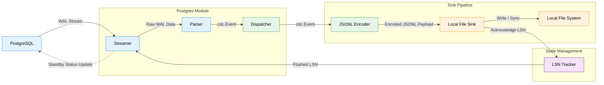

# About

- This project should stream the logical change data capture events from PostgreSQL to a file
- Should capture create, update and delete operation payload
- Should capture the existing data

## Who is the end user?

- Anyone who wants to stream the change events from postgres

## What is the scope of this project?

- This project captures the logical change data capture payloads from postgres and streams to the file.

## How end users will use this project?

- This should be a single binary file
- End user will specify the source postgres database connection details in YML file
- End user will specify the destination disk storage where the change data capture payload files can be written

## Architecture & Modules

Here is a high-level overview of how the internal modules work together to stream changes from PostgreSQL to the destination.

- **Main (Entry Point)**: Initializes configuration, logger, and bootstraps the pipeline by linking the Postgres, Dispatcher, and Sink modules together.
- **Postgres Module**: Manages the connection to the PostgreSQL database. It listens to logical replication slots, receives WAL (Write-Ahead Log) messages, parses them into structured `cdc.Event` payloads, and forwards them to the Dispatcher. It also handles sending keepalive and standby status updates back to Postgres to advance the LSN (Log Sequence Number).
- **Dispatcher Module**: Acts as the router. It receives parsed `cdc.Event` payloads from the Postgres module and dispatches them to the configured downstream Sink handlers.
- **Sink Module**: The destination for CDC events. It provides an interface to support multiple sinks. The primary implementation is `localfile`, which receives events from the dispatcher and appends them to local files in JSONL format.
- **CDC Module**: Defines the shared domain models (like `Event`) that represent the data payload traversing the system.
- **Config & Logger**: Provide centralized configuration management and structured logging across all components.
